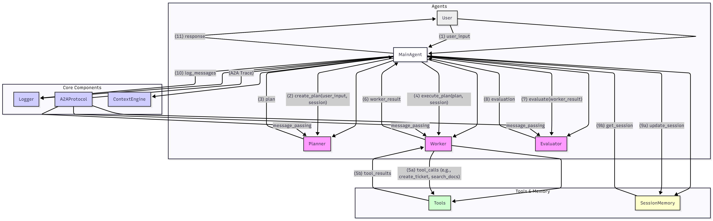

# 🌟 AI Customer Support Agent & Ticket Generator

A fully automated AI Customer Support Agent built using Google ADK with a clean multi-agent architecture.  
This system understands customer issues, generates support tickets, provides solutions, and evaluates responses — all autonomously.

---

## 🧩 Architecture Diagram  
> *(Image automatically displayed if `architecture_diagram.png` is uploaded to your repository root)*



---

# 🚀 Features

### 🧠 Multi-Agent Architecture
- **Planner Agent** – Interprets user input and creates a plan  
- **Worker Agents** – Execute tasks  
  - Safety Worker  
  - Helpline Worker  
- **Evaluator Agent** – Validates the result  
- **Main Agent** – Central orchestrator

### 🎫 Intelligent Ticket Handling
- Auto-generates unique ticket IDs  
- Extracts and stores user details  
- Updates ticket state  

### 💾 Session Memory
- Tracks conversation history  
- Stores user context  

### 🔧 Modular ADK Design
- Clean folder structure  
- Separation of logic  
- Extendable for more agents/tools  

### 🧪 Demo Script Included
Run:
```bash
python run_demo.py
```

---

# 📁 Project Structure

```
project/
│
├── agents/
│   ├── planner.py
│   ├── worker.py
│   └── evaluator.py
│
├── core/
│   ├── routing.py
│   └── observability.py
│
├── memory/
│   └── session_memory.py
│
├── tools/
│   └── tools.py
│
├── app.py
├── main_agent.py
├── requirements.txt
└── run_demo.py
```

---

# ⚙️ Installation & Running

### 1️⃣ Clone the repository
```bash
git clone https://github.com/<your-username>/AI-Customer-Support-Agent-and-Ticket-Generator.git
cd AI-Customer-Support-Agent-and-Ticket-Generator/project
```

### 2️⃣ Install dependencies
```bash
pip install -r requirements.txt
```

### 3️⃣ Add your Google API Key

**Windows:**
```bash
set GOOGLE_API_KEY=your_api_key_here
```

**macOS / Linux:**
```bash
export GOOGLE_API_KEY=your_api_key_here
```

### 4️⃣ Run the demo
```bash
python run_demo.py
```

---

# 💬 Example Usage

**User Message:**
> My name is Raj. My number is +971501234567. My app keeps crashing when I login.

**AI Output:**
- Extracts user name  
- Creates ticket: `TCKT-00001`  
- Suggests troubleshooting  
- Stores session context  

**Final Response:**
```
Thank you Raj. Your ticket TCKT-00001 has been created with status 'Open'.
Try clearing your cache or updating the app to the latest version.
```

---

# 🤝 Contributing
Contributions are welcome!  
Refer to **CONTRIBUTING.md** before submitting PRs.

---

# 📄 License
Licensed under the **MIT License**.  
See `LICENSE.txt` for details.
