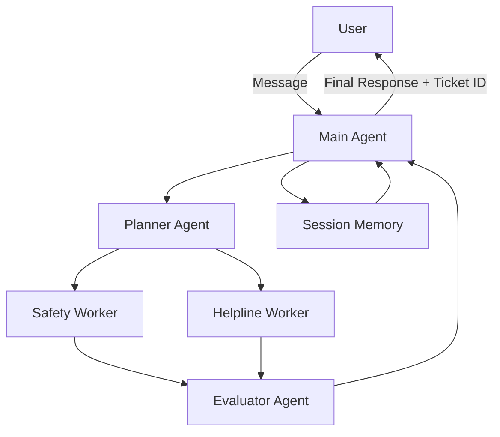

# 🌟 **AI Customer Support Agent & Ticket Generator**

A fully automated **AI Customer Support Agent** powered by a **multi-agent architecture** using **Google ADK**.  
This system understands customer issues, generates support tickets, provides quick solutions, and evaluates response quality — all autonomously.
---

# 🚀 **Features**

### 🧠 Multi-Agent Architecture
- **Planner Agent** → Creates plan from user input  
- **Worker Agents** → Execute plan (Safety Worker + Helpline Worker)  
- **Evaluator Agent** → Checks response quality  
- **Main Agent** → Orchestrates everything  

### 🎫 Intelligent Ticket Handling
- Creates unique ticket IDs  
- Tracks customer issue details  
- Provides support solutions automatically  

### 💾 Session Memory
- Tracks conversation across messages  
- Saves user context (name, phone, issue, status)

### 🔧 Modular ADK Design
- Clean folder structure  
- Easy to extend with new agents or tools  

### 🧪 Demo Script Included
Run:
```bash
python run_demo.py
```
To test agent with sample queries.

---

# 📁 **Project Structure**

```
project/
│
├── agents/
│   ├── planner.py
│   ├── worker.py
│   └── evaluator.py
│
├── core/
│   ├── routing.py
│   └── observability.py
│
├── memory/
│   └── session_memory.py
│
├── tools/
│   └── tools.py
│
├── app.py
├── main_agent.py
├── requirements.txt
└── run_demo.py
```

---

# 🧩 **Architecture Diagram (Mermaid)**



---

# ⚙️ **Installation & Running**

### 1️⃣ Clone the repository
```bash
git clone https://github.com/<your-username>/AI-Customer-Support-Agent-and-Ticket-Generator.git
cd AI-Customer-Support-Agent-and-Ticket-Generator/project
```

### 2️⃣ Install dependencies
```bash
pip install -r requirements.txt
```

### 3️⃣ Add your Google API Key  
In your terminal:

**Windows:**
```bash
set GOOGLE_API_KEY=your_api_key_here
```

**macOS / Linux:**
```bash
export GOOGLE_API_KEY=your_api_key_here
```

### 4️⃣ Run the demo
```bash
python run_demo.py
```

---

# 💬 **Example Usage**

**User:**  
> My name is Raj. My number is +971501234567. My app keeps crashing when I login.

**Agent Output:**  
✔ Extracts user name  
✔ Creates ticket: `TCKT-00001`  
✔ Suggests fix  
✔ Stores information in session  

**Response:**  
```
Thank you Raj. Your ticket TCKT-00001 has been created with status 'Open'.
Try clearing your cache or updating the app to the latest version.
```

---

# 🛠 **Tech Stack**

| Component | Technology |
|----------|------------|
| AI Model | Google Gemini (via ADK) |
| Framework | Google AI Studio ADK |
| Language | Python |
| Architecture | Multi-Agent System |
| Memory Handling | Custom SessionMemory |
| Demo | CLI (Python) |

---

# 🤝 **Contributing**

Pull requests are welcome!  
Please read **CONTRIBUTING.md** before submitting a PR.

---

# 📄 **License**

This project is licensed under the **MIT License**.  
See `LICENSE.txt` for details.


